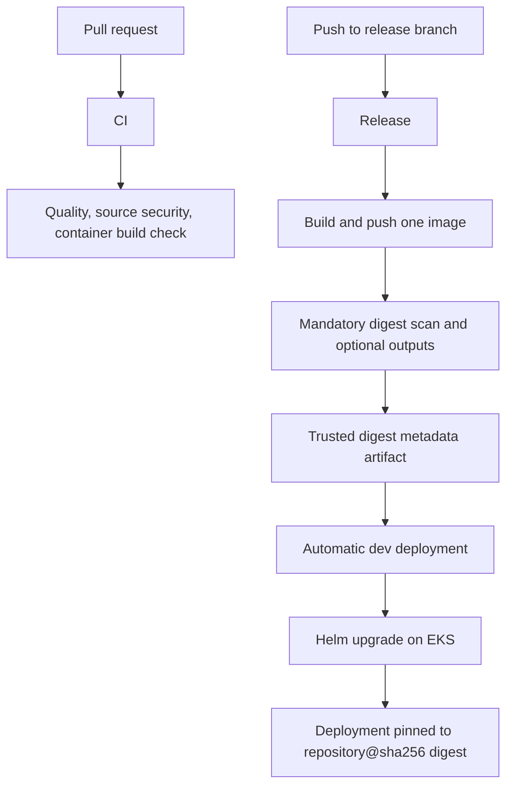

# Client Repository CI/CD Template

This directory contains the configuration, schema, scripts, and documentation for the self-contained CI/CD implementation. The executable workflows and local Action live at repository-root `.github/`, where GitHub can discover them.

```text
.github/
  actions/deploy-eks/action.yaml
  actions/load-platform-config/action.yaml
  workflows/ci.yaml
  workflows/release.yaml
  workflows/deploy.yaml
ci-cd-platform/
  .platform/
  scripts/
  docs/
```

The client repository is expected to contain the application Dockerfile plus the configured Helm chart and environment values. In this accelerator, the matching defaults are:

```text
helm-chart/
deployment-config/values/dev.yaml
deployment-config/values/staging.yaml
deployment-config/values/production.yaml
```

## Flow



Configuration lives in `ci-cd-platform/.platform/config.yaml`. CI runs for pull requests without AWS credentials. Release uses GitHub OIDC to publish to ECR and records the exact scanned digest in a non-secret artifact. Deploy starts only after a successful push-triggered Release and automatically targets `dev`; manual runs can select `dev`, `staging`, or `production`.

The checked-in defaults target a private repository on GitHub Free: GitHub Code Scanning
uploads, GitHub artifact attestation, GitHub Environment jobs, SBOM storage, and Docker build
records are all optional and disabled. The blocking local security scans and immutable-digest
deployment checks remain enabled.

The automatic Release branch remains a literal in `.github/workflows/release.yaml` because GitHub evaluates workflow triggers before it can read repository configuration.

See `docs/how-to-use.md`, `docs/configuration-reference.md`, and `docs/security-boundaries.md` before onboarding a repository.
